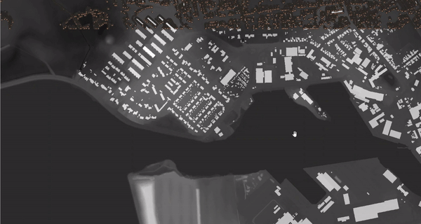

# Terrain simplication for hydraulic modelling

This repo contains code for generating simplified digital terrain model that can be used for hydraulic modelling. 
- The program takes in the sattelite elevation data in image file called .tif. 
- These images are very large in size and needs to be trimmed off without losing the important elevation points (for example significant gradient changes)
- Hence an algorithm was developed based on edge detection to identify these important elevation points
- These points are exported in csv format (containing the x,y,z coordinates)
- Then this data can be imported in modelling software, for example the delimited file can be imported in QGIS software and can be used for further analysis

## Working of the algorithm on NAKSOV, Denmark

This picture shows how the edge detection algorithm is identify the gradient changes:

## Some more examples:
urban area:

rural area:

This is still in development and more improvement is needed. Feel free to fork your own copy and contribute to this project.

